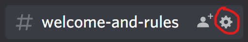
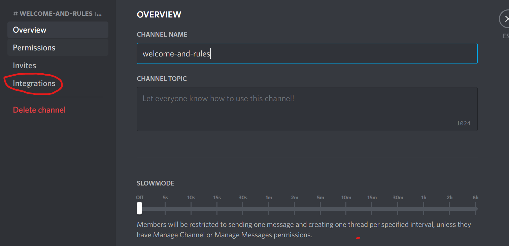

# Pretendabot ©

Pretend to be a discord bot!

---

---

## About

Pretendabot© is an app that lets you become a discord bot!.

It uses discord intrigrations(webhooks) and lets you impersonate a bot/webhook.

Use this app to trick your friends into thinking they are talking to a bot!

Use the web version [here](https://pretendabot.anvil.app/)

## Install

### Download and install

1. Download the latest version [here](https://github.com/Advik-B/Pretendabot/releases)
2. Run the installer

### How to use

3. Open Discord
4. Make shure you have the `manage channels` permission
5. Click on the cog icon/`edit channel` on your favorate channel it should look like this

6. Click on `Integrations` tab: (it should look like this)

7. On the webhooks tab click on `Create Webhook`

8. Name you bot
9. Click on `Copy WebHook url`

10. Open the app
11. Paste the webhook url in `WebHook Urls seprated by commas:`

## Legal
### Attribution
The app icon/logo is by [@hlooola](https://www.cleanpng.com/users/@hlooola.html)

## Contacts

